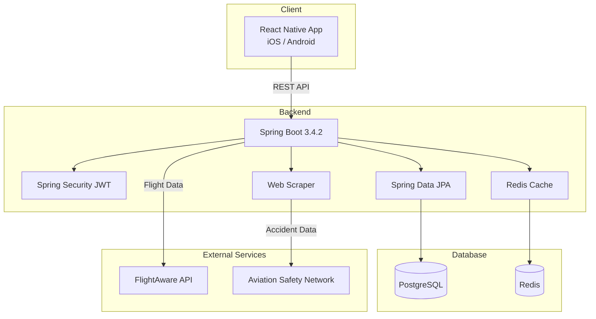
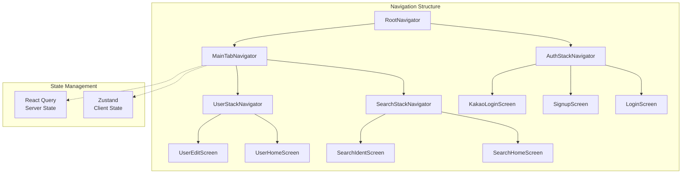

<div align="center">

# 🛩️ PlaneBlackBox

**비행편 번호 하나로, 항공기의 과거를 추적하다**

`2025.03 ~ 2025.05`

</div>

---

## 프로젝트 소개

내가 탈 비행기, 과거에 무슨 일이 있었을까?

**PlaneBlackBox**는 비행편 번호만 입력하면 해당 항공기의 기종과 등록번호를 즉시 확인하고, 과거 사고 이력까지 조회할 수 있는 모바일 앱입니다.

기존에는 항공기 사고 기록을 확인하려면 여러 해외 사이트를 직접 검색해야 했습니다. PlaneBlackBox는 이 과정을 하나의 앱 안에서 해결합니다.

### 핵심 기능

| 기능 | 설명 |
|------|------|
| **비행편 조회** | 비행편 번호 입력 → 항공기 기종 및 등록번호 자동 조회 |
| **사고 이력 검색** | 항공기 등록번호 기반 과거 사고 기록 조회 |
| **소셜 로그인** | 카카오, 애플 간편 로그인 |
| **다크/라이트 테마** | 시스템 설정 연동 자동 전환 |

---

## 기술 스택

### Frontend


### Backend


### Infra & DevOps


### Design


---

## 시스템 아키텍처



---

## 백엔드 아키텍처

레이어드 아키텍처 기반 Spring Boot 애플리케이션

```mermaid
graph LR
    subgraph presentation [Presentation Layer]
        AUTH_CTRL[AuthController]
        MEMBER_CTRL[MemberController]
        FLIGHT_CTRL[FlightInfoController]
        ACCIDENT_CTRL[PlaneAccidentController]
    end
    subgraph business [Business Layer]
        AUTH_SVC[AuthService]
        MEMBER_SVC[MemberService]
        FLIGHT_SVC[FlightAwareService]
        SCRAPING_SVC[ScrapingService]
    end
    subgraph data [Data Layer]
        MEMBER_REPO[MemberRepository]
        ACCIDENT_REPO[AccidentRepository]
        AIRCRAFT_REPO[AircraftRepository]
    end
    subgraph infra [Infrastructure]
        PG[(PostgreSQL)]
        RD[(Redis)]
        EXT[External APIs]
    end
    presentation --> business
    business --> data
    data --> infra
    business --> infra
```



### 주요 컴포넌트

| 레이어 | 역할 |
|--------|------|
| **Controller** | REST API 엔드포인트 제공 |
| **Service** | 비즈니스 로직 처리, 외부 API 연동 |
| **Repository** | JPA 기반 데이터 접근 계층 |
| **Security** | JWT 기반 인증/인가 (Access + Refresh Token) |
| **Scraper** | Selenium + JSoup 기반 항공 사고 데이터 수집 |

---

## 프론트엔드 아키텍처

React Navigation 기반 네비게이션 + Zustand / React Query 상태 관리



### 상태 관리 전략

| 구분 | 라이브러리 | 용도 |
|------|-----------|------|
| **Client State** | Zustand | 사용자 프로필, 테마 설정 등 |
| **Server State** | React Query | API 데이터 캐싱, 동기화, 리페칭 |

---

## 프로젝트 구조

### Backend

```
src/main/java/com/suhkang/inquiryingaccident/
├── controller/       # REST API 컨트롤러
├── service/          # 비즈니스 로직
├── repository/       # JPA 레포지토리
├── object/
│   ├── dao/          # JPA 엔티티
│   ├── dto/          # 데이터 전송 객체
│   └── mapper/       # MapStruct 매퍼
├── config/           # 설정 (Security, Redis, CORS 등)
└── global/           # 공통 모듈 (예외 처리, 필터, AOP 로깅)
```

### Frontend

```
src/
├── api/              # Axios 인스턴스 및 API 호출
├── components/       # 재사용 UI 컴포넌트
├── screens/          # 화면 컴포넌트
├── navigations/      # 네비게이션 설정
├── store/            # Zustand 스토어
├── hooks/            # 커스텀 훅 (React Query 포함)
├── types/            # TypeScript 타입 정의
├── constants/        # 상수 (색상, 설정)
└── utils/            # 유틸리티 함수
```

---

## 팀원

<div align="center">

| 이름 | GitHub | 역할 |
|:----:|:------:|:----:|
| 강주현 | [@juhyunk0820](https://github.com/juhyunk0820) | Frontend |
| 서새찬 | [@Cassiiopeia](https://github.com/Cassiiopeia) | Backend |
| 윤지희 | [@jihee127](https://github.com/jihee127) | Design |

</div>

---

<div align="center">

**PlaneBlackBox** — 비행의 기록을 추적하다

</div>
