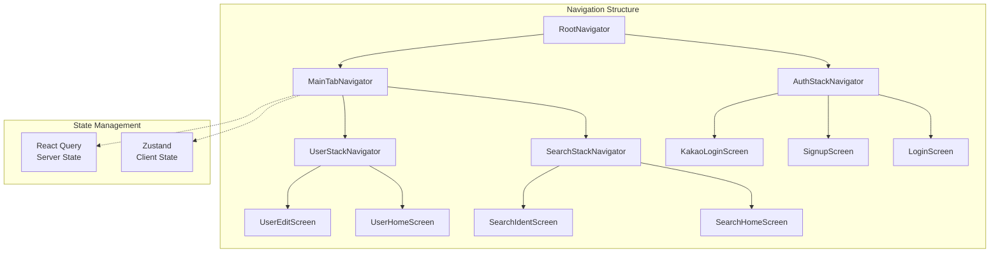

<div align="center">

# ✈️ InquiryingAccident

**비행편 번호로 항공기의 사고 이력을 조회할 수 있는 모바일 앱**

`2025.03 ~ 2025.05`

</div>

---

## 프로젝트 소개

항공기 사고 기록을 간편하게 조회할 수 있는 서비스의 부재를 해결하기 위해 개발된 모바일 애플리케이션입니다.

비행편 번호만 입력하면 해당 항공기의 기종과 등록번호를 확인할 수 있으며, 이를 통해 과거 사고 이력을 조회할 수 있습니다.

### 핵심 기능

- **비행편 조회**: 비행편 번호 입력 시 항공기 기종 및 등록번호 자동 조회
- **사고 이력 검색**: 항공기 등록번호 기반 사고 기록 데이터베이스 검색
- **소셜 로그인**: 카카오, 애플 간편 로그인 지원
- **테마 지원**: 다크/라이트 모드 자동 전환

---

## 기술 스택

### Frontend


### Backend


### Infra & DevOps


### Design


---

## 시스템 아키텍처


---

## 백엔드 아키텍처

레이어드 아키텍처 기반의 Spring Boot 애플리케이션



```mermaid
graph LR
    subgraph presentation [Presentation Layer]
        AUTH_CTRL[AuthController]
        MEMBER_CTRL[MemberController]
        FLIGHT_CTRL[FlightInfoController]
        ACCIDENT_CTRL[PlaneAccidentController]
    end
    subgraph business [Business Layer]
        AUTH_SVC[AuthService]
        MEMBER_SVC[MemberService]
        FLIGHT_SVC[FlightAwareService]
        SCRAPING_SVC[ScrapingService]
    end
    subgraph data [Data Layer]
        MEMBER_REPO[MemberRepository]
        ACCIDENT_REPO[AccidentRepository]
        AIRCRAFT_REPO[AircraftRepository]
    end
    subgraph infra [Infrastructure]
        PG[(PostgreSQL)]
        RD[(Redis)]
        EXT[External APIs]
    end
    presentation --> business
    business --> data
    data --> infra
    business --> infra
```

### 주요 컴포넌트

- **Controller**: REST API 엔드포인트 제공
- **Service**: 비즈니스 로직 처리 및 외부 API 연동
- **Repository**: JPA 기반 데이터 접근 계층
- **Security**: JWT 기반 인증/인가 처리
- **Scraper**: Selenium + JSoup 기반 웹 스크래핑

---

## 프론트엔드 아키텍처

React Navigation 기반 네비게이션 구조 및 Zustand + React Query 상태 관리



### 상태 관리 전략

- **Zustand**: 사용자 프로필, 테마 설정 등 클라이언트 상태 관리
- **React Query**: API 데이터 캐싱, 동기화, 리페칭 등 서버 상태 관리

---

## 주요 기능

| 기능 | 설명 | 기술 |
|------|------|------|
| **비행편 조회** | 비행편 번호로 항공기 정보 검색 | FlightAware API 연동 |
| **사고 이력 검색** | 등록번호 기반 사고 기록 조회 | PostgreSQL 전문 검색 |
| **웹 스크래핑** | Aviation Safety Network 데이터 수집 | Selenium + JSoup |
| **인증/인가** | JWT 기반 토큰 인증 및 소셜 로그인 | Spring Security, Kakao/Apple OAuth |
| **캐싱** | 자주 조회되는 데이터 캐싱 | Redis (24시간 TTL) |
| **API 문서화** | 자동 생성된 API 문서 제공 | Swagger/OpenAPI |
| **다크 모드** | 시스템 테마 자동 감지 및 전환 | React Native Appearance API |

---

## 프로젝트 구조

### Backend (Spring Boot)

```
IA-BE-main/
├── src/main/java/com/suhkang/inquiryingaccident/
│   ├── controller/       # REST API 컨트롤러
│   ├── service/          # 비즈니스 로직
│   ├── repository/       # JPA 레포지토리
│   ├── object/
│   │   ├── dao/          # JPA 엔티티
│   │   ├── dto/          # 데이터 전송 객체
│   │   └── mapper/       # MapStruct 매퍼
│   ├── config/           # 설정 클래스
│   └── global/           # 공통 모듈 (예외, 필터, 로깅)
├── src/main/resources/
│   ├── static/           # 정적 리소스
│   └── templates/        # Thymeleaf 템플릿 (관리자 페이지)
└── Dockerfile
```

### Frontend (React Native)

```
IA-FE-develop/
├── src/
│   ├── api/              # API 통신 레이어
│   ├── components/       # 재사용 가능한 UI 컴포넌트
│   ├── screens/          # 화면 컴포넌트
│   ├── navigations/      # 네비게이션 설정
│   ├── store/            # Zustand 스토어
│   ├── hooks/            # 커스텀 훅 (React Query 포함)
│   ├── types/            # TypeScript 타입 정의
│   ├── constants/        # 상수 (색상, 설정 등)
│   └── utils/            # 유틸리티 함수
├── android/              # Android 네이티브 코드
├── ios/                  # iOS 네이티브 코드
└── App.tsx               # 루트 컴포넌트
```

---

## 팀원

| 이름 | GitHub | 역할 |
|------|--------|------|
| 강주현 | [@juhyunk0820](https://github.com/juhyunk0820) | Frontend |
| 서새찬 | [@Cassiiopeia](https://github.com/Cassiiopeia) | Backend |
| 윤지희 | [@jihee127](https://github.com/jihee127) | Design |

---

<div align="center">

**Made with ❤️ by InquiryingAccident Team**

</div>
